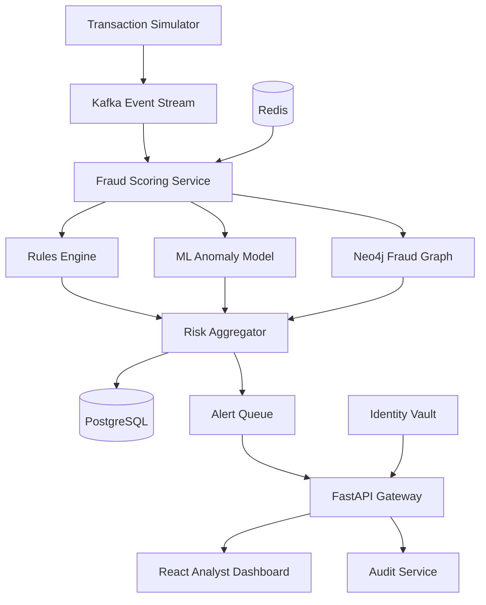

# AegisGraph AI

**Real-Time Digital Payment Fraud Detection & Privacy-Preserving Identity Platform**

AegisGraph AI is an enterprise-style platform that detects suspicious digital-payment activity in real time, discovers coordinated fraud rings, explains every risk decision, and protects user identity through tokenization and controlled access.

## The Problem 

Traditional rule-based fraud systems struggle with new attack patterns, coordinated accounts, false positives, and fragmented identity data. AegisGraph AI combines streaming rules, machine-learning anomaly detection, graph analysis, and privacy controls in one auditable platform.

## Core Objectives

- Ingest and validate a live stream of payment transactions.
- Calculate a risk score with rules and machine-learning models.
- Detect linked accounts, devices, merchants, and fraud rings in a graph.
- Generate human-readable explanations for flagged transactions.
- Protect personally identifiable information with irreversible hashes and reversible tokenization where authorized.
- Provide APIs and a dashboard for analysts to investigate alerts.
- Maintain immutable audit events for important security actions.
- Measure detection quality, latency, throughput, and false-positive rate.

## Planned Architecture



## Technology Stack

| Layer | Technology |
| --- | --- |
| Frontend | React, TypeScript, Vite, Tailwind CSS |
| API and services | Python, FastAPI, Pydantic, SQLAlchemy |
| Transaction database | PostgreSQL |
| Graph intelligence | Neo4j |
| Cache and rate limits | Redis |
| Event streaming | Apache Kafka |
| Machine learning | scikit-learn, XGBoost, SHAP |
| Authentication | JWT, role-based access control |
| Privacy and security | Fernet/AES encryption, HMAC tokenization, audit logs |
| Observability | Prometheus, Grafana, structured logging |
| Testing | Pytest, Locust, Playwright |
| Deployment | Docker Compose, GitHub Actions |

## Main Modules

1. **Transaction Ingestion** — receives events, validates schemas, rejects duplicates, and publishes normalized transactions.
2. **Fraud Rules Engine** — evaluates velocity, amount, location, device, merchant, and account-takeover rules.
3. **ML Risk Engine** — learns normal behavior and detects anomalous transactions.
4. **Fraud Graph Engine** — finds shared devices, circular transfers, mule accounts, and suspicious communities.
5. **Identity Vault** — separates sensitive identity data from operational records.
6. **Explainability Engine** — shows the factors that increased or reduced each score.
7. **Case Management API** — supports alerts, assignments, notes, decisions, and evidence.
8. **Analyst Dashboard** — visualizes transactions, graphs, alerts, metrics, and investigations.
9. **Audit and Monitoring** — records privileged actions and tracks system health.

## Risk-Scoring Strategy

The final risk score will combine multiple independent signals:

```text
final_risk = 0.35 * rules_score
           + 0.30 * anomaly_score
           + 0.25 * graph_score
           + 0.10 * identity_score
```

Weights will be configurable and later calibrated using evaluation data. A decision policy will map the score to `ALLOW`, `REVIEW`, or `BLOCK` without hiding the contributing reasons.

## Non-Functional Targets

- P95 scoring latency below 250 ms in the local test environment.
- Idempotent processing for duplicate transaction events.
- Complete audit trail for analyst and administrator actions.
- No plaintext PII in transaction, alert, or analytics tables.
- Automated unit, integration, security, and load tests.
- Reproducible local environment using Docker Compose.

## 20-Day Build Outcome

By Day 40, the repository will contain a working full-stack prototype with simulated streaming data, hybrid fraud scoring, graph investigations, privacy controls, evaluation reports, automated tests, observability, documentation, and a deployment-ready container setup.

## Development Rule

One planned file is added each day. Every commit must contain a meaningful project artifact—source code, configuration, test, migration, or technical documentation. Empty or artificial files are not part of this challenge.

## Day 4

- Defined the problem, goals, architecture, technology stack, modules, scoring strategy, engineering targets, and final deliverable.

## License

This project is intended for educational and research use. Fraud decisions produced by the prototype must not be used in a real financial system without professional security review, regulatory assessment, bias testing, and human oversight.
